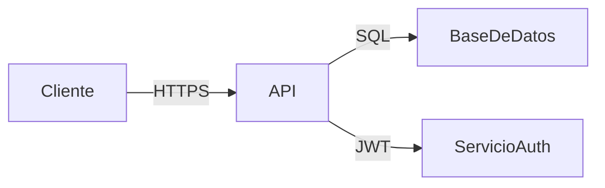
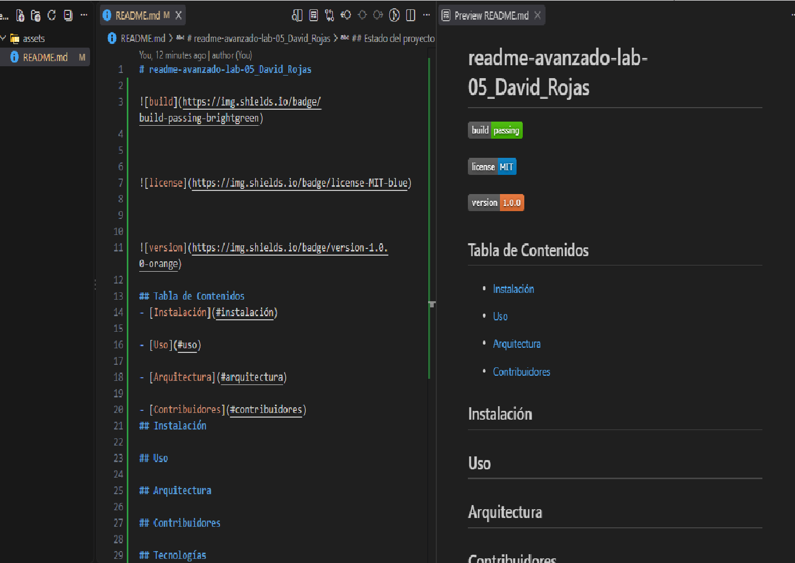

# readme-avanzado-lab-05_David_Rojas

## Tabla de Contenidos
- [Instalación](#instalación)

- [Uso](#uso)

- [Arquitectura](#arquitectura)

- [Contribuidores](#contribuidores)
## Instalación

## Uso

## Arquitectura

## Contribuidores

## Tecnologías
| Tecnología | Versión | Propósito |
|---------|------------|------------|
| Node.js | 18.x | Servidor Backend |
| React | 18.x | Interfaz de Usuario |
| Mongo DB | 6.x | Base de datos |

## Estado del proyecto

- [x] Autenticación de usuarios
- [x] CRUD de tareas
- [ ] Notificaciones en tiempo real
- [ ] Despliegue en producción

## Arquitectura 

## Capturas

## Contribuidores
- [@Dxxsc22](https://github.com/Dxxsc22) — Desarrollo y Documentación.